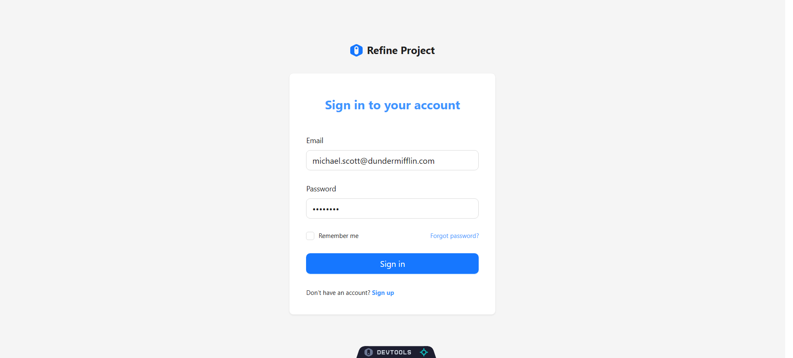
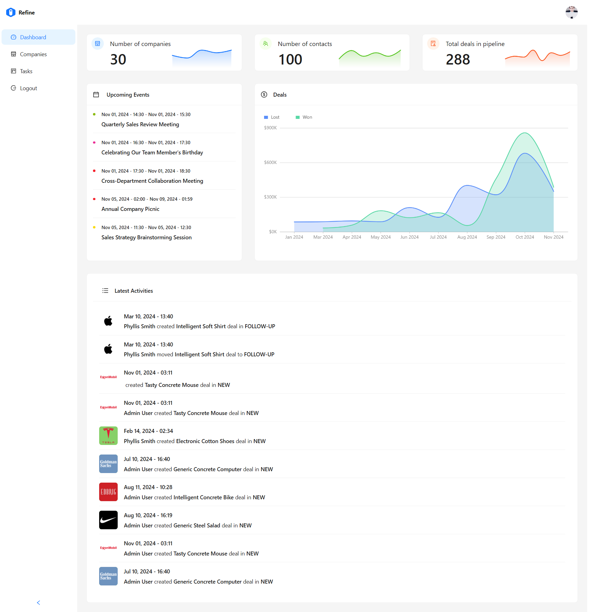
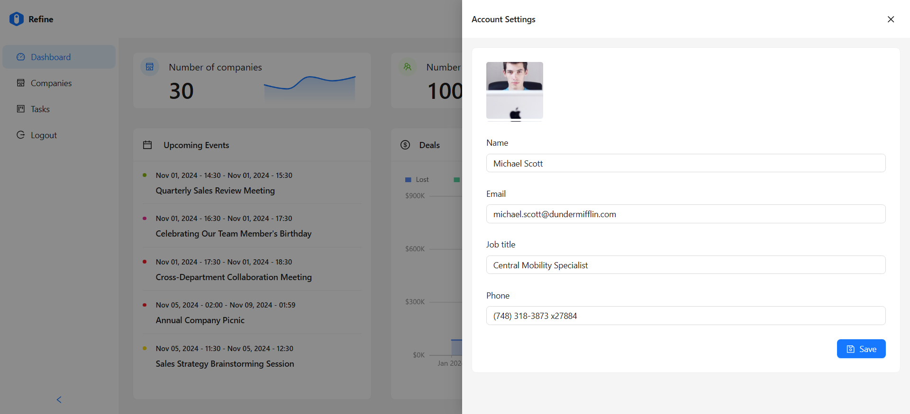
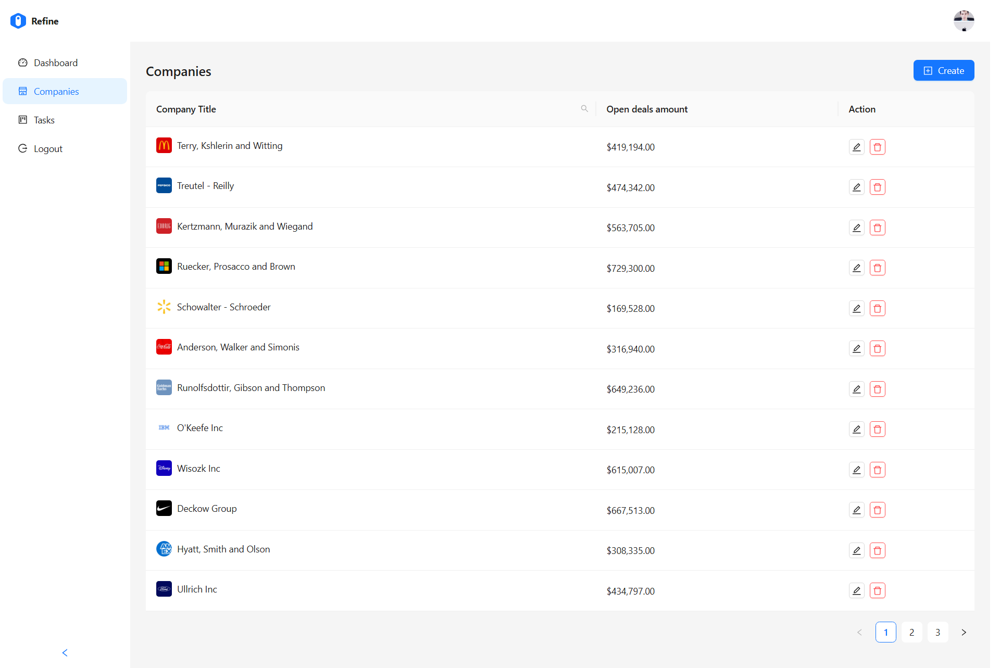
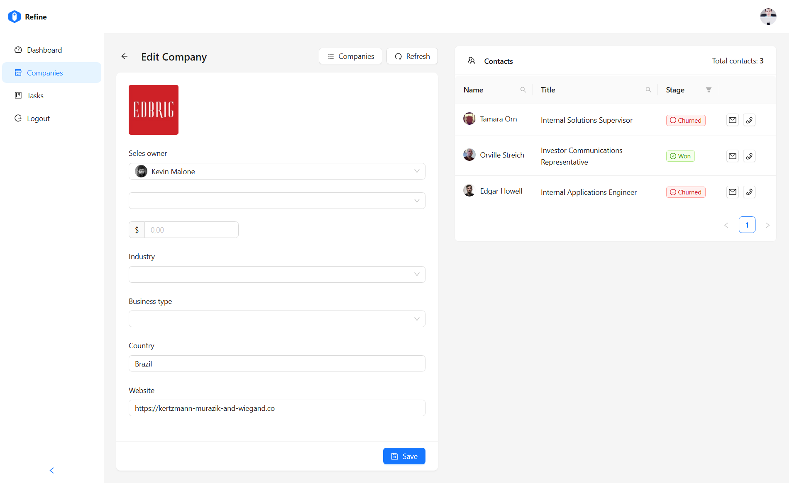
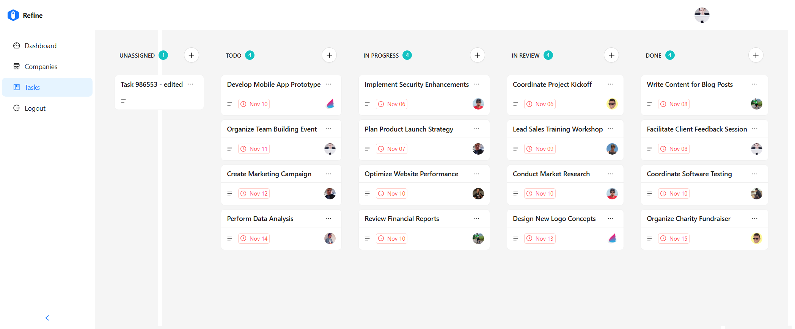
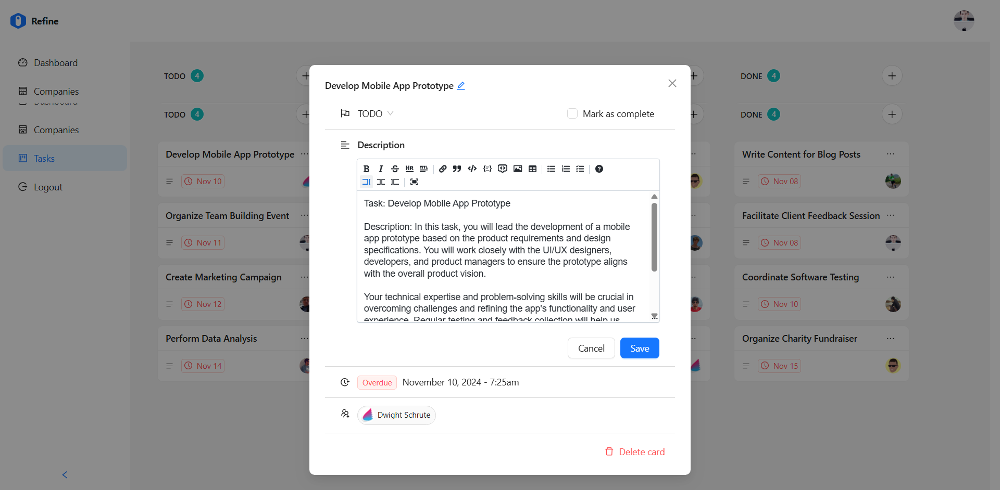

# 📊 Refined Admin Dashboard

This project — **Refined Admin Dashboard** — was built after following the excellent tutorial by  
👨‍🏫 **[Adrian Hajdin](https://www.youtube.com/@javascriptmastery)** from **JavaScript Mastery**.  

It’s a **modern admin dashboard** built with **React.js**, **TypeScript**, **Refine**, and **Ant Design**, focused on  
clean architecture, scalability, and elegant UI/UX design.

## 🚨 Tutorial

This repository is based on the **Refine Admin Dashboard** tutorial from *JavaScript Mastery’s YouTube channel* 🎬.  
If you enjoy learning visually, check out the step-by-step walkthrough on YouTube — it’s beginner-friendly yet production-level!  

   
  
   

  

    
    
    
    
  

---

## ⚙️ **Tech Stack & Tools**

| 💡 Technology / Tool            | ⚙️ Description                                                                 |
| ------------------------------- | ------------------------------------------------------------------------------ |
| ⚛️ **React.js**                 | Core library for building fast, modular, and interactive UIs.                  |
| 🟦 **TypeScript**               | Adds static typing for safer and more maintainable code.                       |
| ⚡ **Refine Framework**         | Powerful React-based framework for CRUD, routing, and data management.         |
| 🎨 **Ant Design (AntD)**        | Elegant enterprise-level UI component library.                                 |
| 🧩 **GraphQL + GraphQL-WS**     | Query language and subscription layer for efficient, real-time data fetching.  |
| 🧠 **GraphQL Codegen**          | Auto-generates TypeScript types and hooks from GraphQL schemas.                |
| 🧭 **React Router v7**          | Handles navigation and routing between app pages.                              |
| 🪄 **Dnd Kit**                  | Enables smooth drag-and-drop functionality (used in Kanban board).             |
| 🧱 **@uiw/react-md-editor**     | Markdown editor for editing task descriptions or notes.                        |
| 📅 **Day.js**                   | Lightweight library for date and time formatting.                              |
| 🚀 **Vite**                     | Ultra-fast development server and bundler for modern web apps.                 |
| 🧰 **ESLint & Prettier**        | Maintain consistent and clean code style.                                      |
| 🧮 **Refine Devtools & Kbar**   | Developer tools and command bar to enhance productivity inside Refine.         |

---

## 🔋 **Core Features**

| 🧱 Feature                   | 💬 Description                                                            |
| ---------------------------- | ------------------------------------------------------------------------- |
| 🔐 **Authentication**        | Secure login, signup, and password recovery system for smooth onboarding. |
| 🛡️ **Authorization**         | Role-based access control ensures privacy and secure data handling.       |
| 🏠 **Dashboard**             | Real-time insights with charts, analytics, and key performance metrics.   |
| 🏢 **Companies Management**  | Full CRUD functionality with search, filters, and pagination.             |
| 🗂️ **Kanban Board**          | Interactive task management with drag-and-drop and markdown support.      |
| ⚙️ **Account Settings**      | Manage user profiles, preferences, and personal details easily.           |
| 📱 **Responsive Design**     | Fully adaptive layouts optimized for desktop, tablet, and mobile.         |
| ♻️ **Reusable Architecture** | Modular and scalable structure built for long-term maintainability.       |

---

## 🧠 **React Concepts & Custom Hooks**

| 🧩 Concept / Hook | 🎯 Purpose                                                       |
| ----------------- | ---------------------------------------------------------------- |
| `useState`        | Manage component-level states such as filters or modals.         |
| `useEffect`       | Handle data fetching and perform actions on dependency changes.  |
| `useContext`      | Access global data like authentication or theme context.         |
| `useReducer`      | Simplify and organize complex component state logic.             |
| `useMemo`         | Optimize performance by memoizing derived values.                |
| `useCallback`     | Prevent unnecessary re-renders by memoizing functions.           |
| `useNavigation`   | Custom hook for handling route transitions in Refine.            |
| `useTable`        | Refine hook for efficient table CRUD and pagination logic.       |
| `useForm`         | Refine hook for managing form state, validation, and submission. |

✨ **Built for performance, clarity, and scalability — blending clean design with developer-friendly architecture.**

---

## 📸 Screenshots

### 🖥️ Desktop View  

#### 🔐 Sign In  

#### 📊 Dashboard  

#### ⚙️ Account Settings  

#### 🏢 Companies  

#### 📝 Edit Company  

#### 📋 Tasks  

#### 🖊️ Edit Tasks  

---

## 📚 Useful Links

### 🧑‍🏫 Instructor
* 🌏 **JavaScript Mastery Website:**  
  [https://jsmastery.com/](https://jsmastery.com/)

* 📺 **YouTube Channel:**  
  [https://www.youtube.com/c/JavaScriptMastery](https://www.youtube.com/c/JavaScriptMastery)

* 👨‍💻 **Adrian Hajdin on GitHub:**  
  [https://github.com/adrianhajdin](https://github.com/adrianhajdin)

---

### 👨‍💻 Author

**Maher Elmair**

* 📫 [maher.elmair.dev@gmail.com](mailto:maher.elmair.dev@gmail.com)  
* 🔗 [LinkedIn](https://www.linkedin.com/in/maher-elmair)  
* ✖️ [X (Twitter)](https://x.com/Maher_Elmair)  
* ❤️ Made with passion by [Maher Elmair](https://maher-elmair.github.io/My_Website)

---

## 🔗 Live Preview

🎥 **View the project live on Vercel:**  

🌐 [https://refined-admin-dashboard.vercel.app](https://refined-admin-dashboard.vercel.app)

---

## 🙌 Thank You

If you liked the project, please ⭐ the repository!  
Contributions, feedback, and PRs are always welcome 🙏
